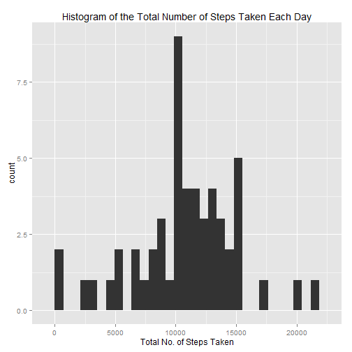
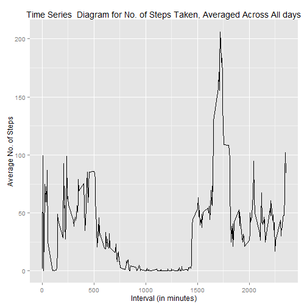
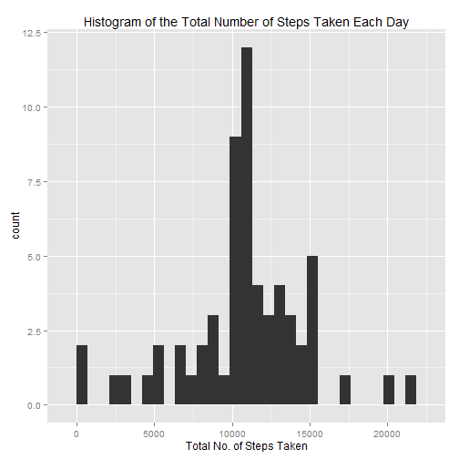
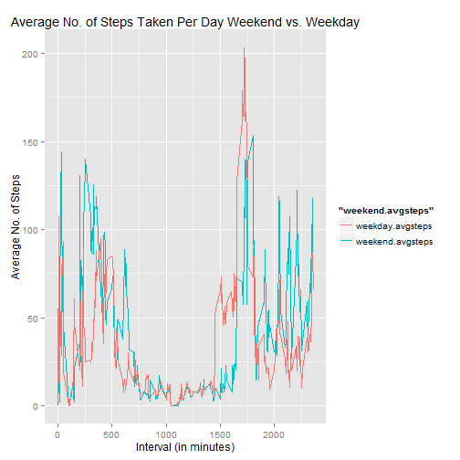

## The Data

"This assignment makes use of data from a personal activity monitoring device. This device collects data at 5 minute intervals through out the day. The data consists of two months of data from an anonymous individual collected during the months of October and November, 2012 and include the number of steps taken in 5 minute intervals each day." (Reproducible Research, Peng, R. et al.)

The data for this assignment can be downloaded from the course web site:

* Dataset: [Activity monitoring data](https://d396qusza40orc.cloudfront.net/repdata%2Fdata%2Factivity.zip)

To download, remove the comments to download, and read the data us the following:

```r
#fileURL<- "https://d396qusza40orc.cloudfront.net/repdata%2Fdata%2Factivity.zip"
#download.file(fileURL, destfile="Factivity.zip")
#unzip("Factivity.zip")
```


```r
data <- read.csv("activity.csv")
```

## Questions

**Packages used**


```r
library(ggplot2)
```


###What is mean total number of steps taken per day?

####1. Calculate the total number of steps taken per day


```r
for(i in 1:length(levels(data$date))){
  data$daily.steps[data$date == levels(data$date)[i]] = sum(data$steps[data$date == levels(data$date)[i]])
}

date  <- levels(data$date)
daily.steps <- 1:61
datasub <- data.frame(date,daily.steps)

for(i in 1:length(levels(datasub$date))){
  datasub$daily.steps[datasub$date == levels(datasub$date)[i]] = sum(data$steps[data$date == levels(data$date)[i]])
}

datasub2 = datasub
colnames(datasub2) = c("date","Total No. of Steps Taken Per Day")

head(datasub2)
```

```
##         date Total No. of Steps Taken Per Day
## 1 2012-10-01                               NA
## 2 2012-10-02                              126
## 3 2012-10-03                            11352
## 4 2012-10-04                            12116
## 5 2012-10-05                            13294
## 6 2012-10-06                            15420
```

####2. Make a histogram of the total number of steps taken each day


```r
qplot(datasub$daily.steps, xlab = "Total No. of Steps Taken", main="Histogram of the Total Number of Steps Taken Each Day")
```

 

####3. Calculate and report the mean and median of the total number of steps taken per day

The **mean** total number of steps taken per day is given by:

```r
mean(datasub$daily.steps,na.rm=T)
```

```
## [1] 10766.19
```
which is approximately

```r
ceiling(mean(datasub$daily.steps,na.rm=T))
```

```
## [1] 10767
```

The **median** total number of steps taken per day is given by:

```r
median(datasub$daily.steps,na.rm=T)
```

```
## [1] 10765
```

###What is the average daily activity pattern?

####1. Make a time series plot of the 5-minute interval (x-axis) and the average number of steps taken, averaged across all days (y-axis)


```r
data$interval <- factor(data$interval)
interval <- levels(factor(data$interval))
avgsteps <- 1:length(interval)

datasubint <- data.frame(interval,avgsteps)

for(i in 1:length(levels(datasubint$interval))){
  datasubint$avgsteps[datasubint$interval == levels(datasubint$interval)[i]] = mean(data$steps[data$interval == levels(data$interval)[i]],na.rm=T)
}

datasubint$interval <- as.numeric(as.character(datasubint$interval))

g <- ggplot(datasubint, aes(x = interval,y = avgsteps))

g + geom_line() + xlab("Interval (in minutes)") + ylab("Average No. of Steps") + ggtitle("Time Series  Diagram for No. of Steps Taken, Averaged Across All days")
```

 


####Which 5-minute interval, on average across all the days in the dataset, contains the maximum number of steps?


```r
datasubint$interval[datasubint$avgsteps == max(datasubint$avgsteps)]
```

```
## [1] 1720
```

The maximum average number of steps occurs at 1720 interval.

###Imputing missing values

####1.Calculate and report the total number of missing values in the dataset (i.e. the total number of rows with NAs) 


```r
length(data$steps[is.na(data$steps)])
```

```
## [1] 2304
```

The total number of missing values is 2304


####2. Devise a strategy for filling in all of the missing values in the dataset. The strategy does not need to be sophisticated. For example, you could use the mean/median for that day, or the mean for that 5-minute interval, etc.

My strategy is to replace each missing step value with its interval average.

####3. Create a new dataset that is equal to the original dataset but with the missing data filled in.


```r
data.no.na = data
datasubint$interval <- factor(datasubint$interval)

for(i in 1:length(datasubint$interval)){
  data.no.na$steps[is.na(data.no.na$steps) & data.no.na$interval == datasubint$interval[i]] = datasubint$avgsteps[i]
}

for(i in 1:length(levels(data$date))){
  data.no.na$daily.steps[data.no.na$date == levels(data.no.na$date)[i]] = sum(data.no.na$steps[data.no.na$date == levels(data.no.na$date)[i]])
}

data.no.na.sub <- data.frame(date,daily.steps)

for(i in 1:length(levels(datasub$date))){
  data.no.na.sub$daily.steps[data.no.na.sub$date == levels(data.no.na.sub$date)[i]] = sum(data.no.na$steps[data.no.na$date == levels(data.no.na$date)[i]])
}

data.no.na.sub2 = data.no.na.sub
colnames(data.no.na.sub2) = c("date","Total No. of Steps Taken Per Day")

head(data.no.na.sub2)
```

```
##         date Total No. of Steps Taken Per Day
## 1 2012-10-01                         10766.19
## 2 2012-10-02                           126.00
## 3 2012-10-03                         11352.00
## 4 2012-10-04                         12116.00
## 5 2012-10-05                         13294.00
## 6 2012-10-06                         15420.00
```

####4.Make a histogram of the total number of steps taken each day and Calculate and report the mean and median total number of steps taken per day.


```r
qplot(data.no.na.sub$daily.steps, xlab = "Total No. of Steps Taken", main="Histogram of the Total Number of Steps Taken Each Day")
```

 

The **mean** total number of steps taken per day is given by:

```r
mean(data.no.na.sub$daily.steps)
```

```
## [1] 10766.19
```
which is approximately

```r
ceiling(mean(data.no.na.sub$daily.steps))
```

```
## [1] 10767
```

The **median** total number of steps taken per day is given by:

```r
median(data.no.na.sub$daily.steps)
```

```
## [1] 10766.19
```
which is approximately

```r
ceiling(median(data.no.na.sub$daily.steps))
```

```
## [1] 10767
```

*The value for the **mean** number of steps is the same, but the **median** is slightly higher, although I am doubtful that change in the median is significantly different.* 


###Are there differences in activity patterns between weekdays and weekends?

1. Create a new factor variable in the dataset with two levels - "weekday" and "weekend" indicating whether a given date is a weekday or weekend day.


```r
data.no.na$weekday <- factor(weekdays(as.Date(data.no.na$date)))

data.no.na$weekday.dum[data.no.na$weekday=="Monday"] = 1
data.no.na$weekday.dum[data.no.na$weekday=="Tuesday"] = 1
data.no.na$weekday.dum[data.no.na$weekday=="Wednesday"] = 1
data.no.na$weekday.dum[data.no.na$weekday=="Thursday"] = 1
data.no.na$weekday.dum[data.no.na$weekday=="Friday"] = 1
data.no.na$weekday.dum[data.no.na$weekday=="Saturday"] = 0
data.no.na$weekday.dum[data.no.na$weekday=="Sunday"] = 0

head(data.no.na)
```

```
##        steps       date interval daily.steps weekday weekday.dum
## 1  1.7169811 2012-10-01        0    10766.19  Monday           1
## 2 99.4528302 2012-10-01        5    10766.19  Monday           1
## 3  0.3396226 2012-10-01       10    10766.19  Monday           1
## 4 31.4905660 2012-10-01       15    10766.19  Monday           1
## 5 25.5471698 2012-10-01       20    10766.19  Monday           1
## 6 74.5471698 2012-10-01       25    10766.19  Monday           1
```

2. Make a panel plot containing a time series plot (i.e. type = "l") of the 5-minute interval (x-axis) and the average number of steps taken, averaged across all weekday days or weekend days (y-axis).


```r
weekday.avgsteps <- 1:length(interval)
weekend.avgsteps = weekday.avgsteps

data.no.na.subint <- data.frame(interval,weekday.avgsteps,weekend.avgsteps)

for(i in 1:length(levels(data.no.na.subint$interval))){
  data.no.na.subint$weekday.avgsteps[data.no.na.subint$interval == levels(data.no.na.subint$interval)[i]] = mean(data.no.na$steps[data.no.na$interval == levels(data.no.na$interval)[i] & data.no.na$weekday.dum ==1])
}

for(i in 1:length(levels(data.no.na.subint$interval))){
  data.no.na.subint$weekend.avgsteps[data.no.na.subint$interval == levels(data.no.na.subint$interval)[i]] = mean(data.no.na$steps[data.no.na$interval == levels(data.no.na$interval)[i] & data.no.na$weekday.dum ==0])
}


data.no.na.subint$interval <- as.numeric(as.character(data.no.na.subint$interval))

g <- ggplot(data.no.na.subint, aes(x = interval,y = weekend.avgsteps, col="blue"))

x <- g + geom_line() + xlab("Interval (in minutes)") + ylab("Average No. of Steps") + ggtitle("Time Series  Diagram for Average No. of Steps Taken Per Day Weekend vs. Weekday") +geom_line(aes(x = interval,y = weekday.avgsteps, col="red")) 

g2 <- ggplot(data.no.na.subint, aes(x = interval))  + geom_line(aes(y = weekend.avgsteps, colour = "weekend.avgsteps")) + geom_line(aes(y = weekday.avgsteps, colour = "weekday.avgsteps")) + xlab("Interval (in minutes)") + ylab("Average No. of Steps") + ggtitle("Average No. of Steps Taken Per Day Weekend vs. Weekday")

g2
```

 

